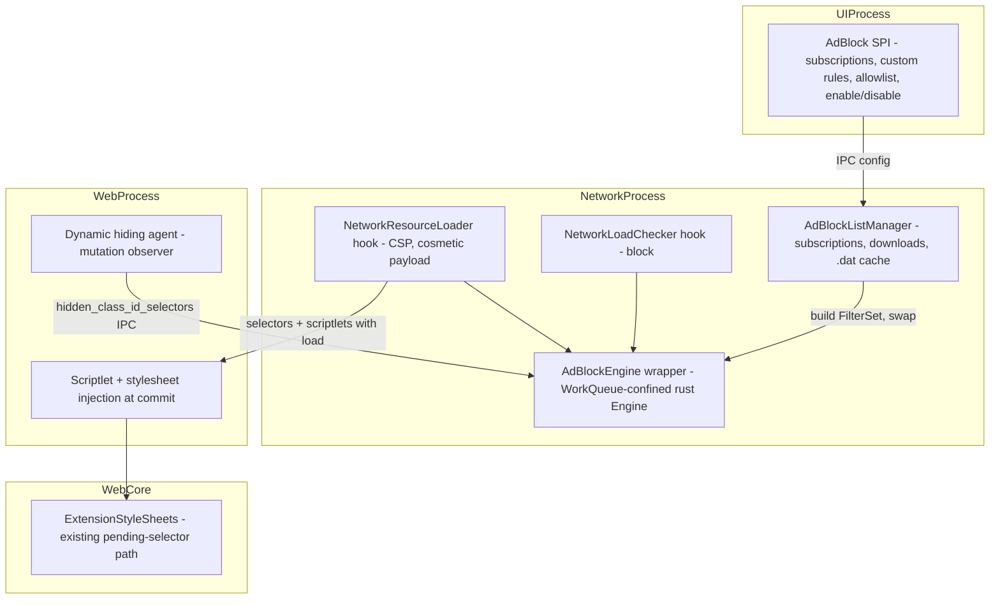
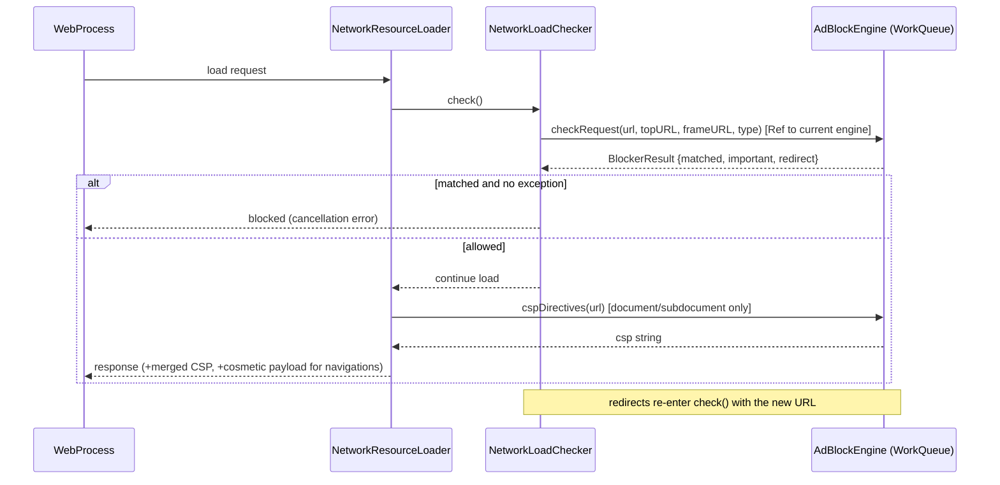
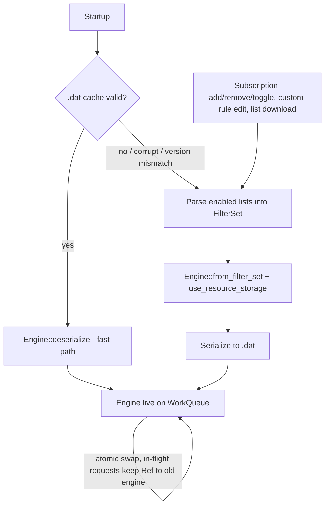

# WebKit Adblock Integration - Plan

**Target repo:** `WebKit/` — file paths below are relative to the WebKit checkout unless prefixed with `adblock-rust/` or `brave-core/` (reference repos in the same workspace).

## Goal Capsule

Integrate adblock-rust into the WebKit fork as the primary ad/tracker filtering engine: network blocking, cosmetic filtering (CSS + scriptlets), and CSP injection on macOS, with all core-WebKit hooks behind `ENABLE(ADBLOCK)` to keep the fork mergeable with upstream.

- **Authority**: Owner decision — no external stakeholder approval needed. This plan (Product Contract + Planning Contract) is authoritative; repo conventions in `CLAUDE.md` override on style/process.
- **Execution profile**: Work units in dependency order (U1 → U10); each unit lands as an atomic commit that builds and passes style check.
- **Stop conditions**: Stop and surface if (a) the cargo→Xcode build integration (U2) cannot produce a linkable static library, (b) a hook cannot stay within the 1-5 line surgical budget, or (c) cosmetic selector delivery cannot reuse the existing content-extensions plumbing — each invalidates a Key Technical Decision rather than a detail.
- **Tail ownership**: Filter list UI, service-worker filtering, and non-macOS ports are explicitly follow-up work, not part of done.

**Product Contract preservation**: changed — the Approach's build-integration bullet (was "CMake following Skia's Rust pattern"; research showed the Cocoa port builds with Xcode and the Skia Rust pattern is CMake-only). The three Outstanding Questions are resolved in the Planning Contract. All other product scope is unchanged.

---

## Product Contract

### Summary

Build a new AdBlocker component around a cxx-bridge FFI crate wrapping adblock-rust, owned by the NetworkProcess on a dedicated work queue. Network blocking, CSP, and cosmetic-CSS computation hook into the existing content-extensions integration points; scriptlet injection and dynamic hide-selector queries add one new pair of WebProcess↔NetworkProcess IPC messages. The Rust library is built by a cargo-invoking Xcode script phase and linked libwebrtc-style via xcconfig.

### Problem

The WebKit fork needs native adblocking to be a viable browser. WebKit's built-in ContentExtensions framework uses a DNR-like format that can't express the full ABP filter list syntax (scriptlets, procedural filters, many redirect rules), making it unsuitable as the sole matching engine for community filter lists like EasyList.

### Target User

Users of the macOS browser built from this WebKit fork who expect modern adblocking comparable to Brave or uBlock Origin.

### Desired Outcome

A browser engine that blocks ads, trackers, and annoyances using standard ABP filter lists, with cosmetic filtering to hide residual ad elements and CSP injection to prevent inline script execution from ad networks.

### Requirements

Network filtering:

- R1. Network requests matching enabled ABP filter rules are blocked in the NetworkProcess before reaching the renderer — including redirect destinations (re-checked on each redirect) and WebSocket connections.
- R2. Document and subdocument responses carry CSP directives returned by the engine, merged with any existing `Content-Security-Policy` header per the CSP combination rules.

Cosmetic filtering:

- R3. CSS hide selectors for a page are computed at navigation time in the NetworkProcess and applied to the document before first paint.
- R4. Scriptlets (uBlock Origin resource library) are injected at document start on pages whose matched filters require them.
- R5. As new class/id attributes appear in the DOM, the page can query additional generic hide selectors and apply them (mutation-driven dynamic hiding).

Engine and filter lists:

- R6. ABP-format filter lists load at runtime; multiple subscriptions can be added, removed, and toggled; users can add custom rules.
- R7. Compiled filter state serializes to disk (adblock-rust `.dat` format) and restores at startup; corrupt or version-mismatched caches fall back to re-parsing source lists.
- R8. A per-site allowlist exempts a host from blocking and cosmetic filtering via engine-level API (no UI in this plan).

Fork hygiene:

- R9. Every modification to an existing core WebKit file is 1-5 lines behind `#if ENABLE(ADBLOCK)`; the AdBlocker component has no reverse dependencies (core code includes adblock headers only at hook sites).
- R10. macOS Cocoa port only; with the flag disabled, WebKit builds cleanly with zero adblock code compiled in.

### Success Criteria

1. Network requests matching EasyList rules are blocked before reaching the renderer.
2. Cosmetic filtering hides ad placeholder elements on major sites (e.g., YouTube, news sites).
3. Scriptlet injection neutralizes anti-adblock scripts on sites that detect blockers.
4. Users can add/remove filter list subscriptions and add custom rules at runtime (via API; UI is separate).
5. Filter state persists across sessions (serialized `.dat` cache) and cold-start with a warm cache is measurably faster than re-parsing.
6. Upstream WebKit merges require no more than resolving conflicts at the feature-flagged hook sites.

### Scope Boundaries

**Out of scope** (outside this work's identity):

- iOS and Linux (GTK/WPE) ports
- Using WebKit's ContentExtensions as the matching engine
- Filter list management UI (browser chrome concern; this plan delivers the engine-level API it will call)
- HTTPS Everywhere / upgrade rules
- DNS-level blocking
- Per-site exception management UI (the engine-level allowlist API is in scope — R8)

**Deferred to follow-up work:**

- Service-worker-initiated fetch filtering (documented v1 limitation; requires plumbing through the SW fetch path)
- Cross-session cosmetic consistency for HTTP-cache-served subresources beyond what the U4 hook placement covers
- Filter list auto-update scheduling/expiry honoring (`! Expires:` metadata); v1 updates on demand
- Update the workspace `CLAUDE.md` note that Brave's FFI lives at `components/adblock_rust_ffi/` — it moved to `brave-core/components/brave_shields/core/common/adblock/rs/`
- Automated API tests for the engine and every hook/management unit (U3–U9): re-added as Swift Testing suites once U10's embedder API allows a `WebPage`/`WKWebView` to enable adblock, load a filter list, and exercise blocking end-to-end. The interim C++ `AdBlockEngine.mm` (U3) test was removed 2026-07-15; U4–U9 ship without their `AdBlock*.mm` API tests for the same reason (see the U4 "Test deferred" note). Each unit's listed test scenarios stand as the required scenarios for the eventual suites.

---

## Planning Contract

### Key Technical Decisions

- **KTD1 — Build: cargo-invoking Xcode script phase + xcconfig linking, not CMake.** The Cocoa port builds with Xcode (`build-webkit` uses `WebKit.xcworkspace`); the Skia Rust integration the brainstorm cited is CMake-only and used by GTK/WPE, not macOS. The precedent is libwebrtc: a script build phase produces `libwebkitadblock.a` into `BUILT_PRODUCTS_DIR`, and xcconfig (`OTHER_LDFLAGS`, `LIBRARY_SEARCH_PATHS`, `HEADER_SEARCH_PATHS` in `Source/WebKit/Configurations/BaseTarget.xcconfig`) links it into the WebKit framework, which covers both NetworkProcess and WebProcess.
- **KTD2 — FFI: cxx bridge crate, pinned crates.io `adblock` dependency.** Mirror Brave's production FFI (`brave-core/components/brave_shields/core/common/adblock/rs/`) using the `cxx` crate rather than a hand-written C API — it safely carries `Vec<String>`, byte buffers, and result types across the boundary. The FFI crate depends on `adblock` from crates.io (pin the version Brave ships, currently 0.12.x, with `single-thread`, `full-regex-handling`, `css-validation`, `resource-assembler` features); the local `adblock-rust/` checkout stays a reference, not a build input.
- **KTD3 — One engine instance, NetworkProcess only, confined to a dedicated WorkQueue.** adblock-rust's `Engine` is not `Send+Sync` with the `single-thread` feature (Brave enforces this with `SequenceBound`; we use a WTF `WorkQueue`). A single engine avoids the per-WebProcess memory multiplier the brainstorm flagged (300k+ rules × N tabs). All queries are async with completion handlers. Engine swap safety: each in-flight check captures a `Ref` to the current engine wrapper, so a list-update swap never destroys an engine under a running request.
- **KTD4 — One engine compiled from all enabled lists (not Brave's default+additional split).** Brave's two-engine split exists for component-updater independence; we rebuild one engine from the full enabled set on any subscription change and atomically swap. Simpler, and exception/`important` semantics work as adblock-rust intends within a single engine.
- **KTD5 — Cosmetic CSS rides the existing content-extensions delivery path.** `url_cosmetic_resources()` is called network-side during main/subframe navigation loads; hide selectors travel to the document the same way ContentExtensions `display: none` selectors do today (the `ContentRuleListResults` → `DocumentLoader` pending-selector → `ExtensionStyleSheets::addDisplayNoneSelector` pipeline, applied at commit — before first paint). No new WebCore subsystem. The exact transport struct to extend (vs. a parallel one) is an implementation-time choice inside U6.
- **KTD6 — Scriptlets and dynamic queries are the only new IPC.** `injected_script` is delivered alongside the navigation's cosmetic payload and injected at document start via the user-script injection machinery; `hidden_class_id_selectors` gets an async WebProcess→NetworkProcess message on `NetworkConnectionToWebProcess`. Everything else reuses existing pipelines (R9).
- **KTD7 — Failure posture: `panic=abort` on a panic-free engine (Brave/Chromium parity); degrade to pass-through on recoverable errors.** *(Revised 2026-07-15 — supersedes the original "catch FFI panics and never crash" decision.)* The FFI crate is compiled with `panic="abort"` rather than catching panics at the boundary, matching Brave/Chromium's production integration: adblock-rust is treated as panic-free on untrusted filter lists and `.dat` payloads, so a genuine panic aborts the process rather than unwinding across the C++ FFI boundary. (A fourth unwinding personality would also overflow macOS's 3-personality compact-unwind limit at link time; `-Wl,-no_compact_unwind` on the WebKit.framework link — scoped to `ENABLE_ADBLOCK` builds — handles the personality carried by the prebuilt Rust `std`, which `panic=abort` on our own crate cannot drop.) **Recoverable** errors still degrade gracefully and must never abort: `.dat` deserialization returning an error — corruption, adblock-rust version bump, or the versioned magic/version/size header guard (U3) rejecting the payload — falls back to re-parsing source lists; malformed filter lines are skipped by the parser (adblock-rust already does this); unrecoverable engine errors disable filtering for the session and log. The "panic-free on untrusted input" assumption is now load-bearing (nothing catches a panic), so it must be backed by fuzzing `engine_with_rules`/`deserialize` against hostile/malformed input in CI, and callers must not rely on graceful degradation for a panic-inducing input.
- **KTD8 — Allowlist checked before the engine.** The per-site allowlist (R8) is a host set consulted in the AdBlocker component before any engine query — allowlisted hosts skip blocking, CSP, and cosmetic computation entirely. Stored alongside subscription config, not inside the engine.
- **KTD9 — Component placement: `Source/WebKit/`, not `Source/WebCore/`.** The engine is process-aware (NetworkProcess-owned, IPC-facing), which is the WebKit layer's job; WebCore is touched only at existing content-extensions reuse points. Layout: `Source/WebKit/NetworkProcess/AdBlock/` (engine service), `Source/WebKit/Shared/AdBlock/` (IPC-serializable types), `Source/WebKit/WebProcess/AdBlock/` (injection side), `Source/ThirdParty/AdblockRust/` (FFI crate).

### High-Level Technical Design

Component topology across processes:

Request blocking sequence (per subresource load):

Filter list lifecycle:

### Sequencing

Three stages, dependency-ordered: **Foundation** (U1 FFI crate → U2 build integration → U3 engine service) proves the risky build spine first; **Hooks** (U4 blocking, U5 CSP, U6 cosmetic CSS, U7 scriptlets, U8 dynamic hiding) each land independently against U3; **Management** (U9 list management, U10 embedder API) completes the product surface. U4 is the first end-to-end user-visible win and should land before the remaining hooks to validate the whole spine.

---

## Implementation Units

| U-ID | Title | Key files | Depends on |
|---|---|---|---|
| U1 | Adblock FFI crate (cxx bridge) | `Source/ThirdParty/AdblockRust/` | — |
| U2 | Build integration + ENABLE(ADBLOCK) | `Source/WebKit/Scripts/build-adblock-rust.sh`, xcconfigs, `Source/WTF/wtf/PlatformEnableCocoa.h` | U1 |
| U3 | AdBlockEngine service in NetworkProcess | `Source/WebKit/NetworkProcess/AdBlock/` | U1, U2 |
| U4 | Network request blocking hook | `Source/WebKit/NetworkProcess/NetworkLoadChecker.cpp` | U3 |
| U5 | CSP header injection hook | `Source/WebKit/NetworkProcess/NetworkResourceLoader.cpp` | U3 |
| U6 | Cosmetic CSS computation + delivery | `Source/WebKit/NetworkProcess/AdBlock/`, `Source/WebCore/loader/DocumentLoader.cpp` | U3, U4 |
| U7 | Scriptlet injection | `Source/WebKit/WebProcess/AdBlock/` | U6 |
| U8 | Dynamic cosmetic hiding agent + IPC | `Source/WebKit/WebProcess/AdBlock/`, `NetworkConnectionToWebProcess.messages.in` | U7 |
| U9 | Filter list management + persistence | `Source/WebKit/NetworkProcess/AdBlock/` | U3 |
| U10 | Embedder API + MiniBrowser wiring | `Source/WebKit/UIProcess/API/`, `Tools/MiniBrowser/` | U9 |

### U1. Adblock FFI crate (cxx bridge)

- **Goal:** A Rust staticlib crate exposing adblock-rust's engine to C++ via cxx: engine construction (from filter set bytes, from serialized `.dat`), `check_network_request`, `get_csp_directives`, `url_cosmetic_resources`, `hidden_class_id_selectors`, `serialize`, filter-set assembly, resource-storage loading, and list metadata parsing.
- **Requirements:** R1-R8 (API surface for all engine capabilities), R7 (serialize/deserialize).
- **Dependencies:** None.
- **Files:** `Source/ThirdParty/AdblockRust/Cargo.toml`, `Source/ThirdParty/AdblockRust/src/lib.rs` (cxx bridge), `Source/ThirdParty/AdblockRust/src/engine.rs`, `Source/ThirdParty/AdblockRust/tests/` (crate tests).
- **Approach:** Model the bridge on Brave's `brave-core/components/brave_shields/core/common/adblock/rs/src/lib.rs` — same function set, minus Chromium-specific pieces (domain-resolver callback: use adblock-rust's default `embedded-domain-resolver` feature instead). Pin `adblock` and `cxx` versions. Every fallible call returns a result type; per KTD7 (revised 2026-07-15) the crate is compiled `panic=abort` and does **not** catch panics at the boundary — adblock-rust is relied on to be panic-free on untrusted input, so a panic aborts rather than unwinding across the FFI. `url_cosmetic_resources` returns its JSON string as-is; C++ side parses.
- **Patterns to follow:** Brave's `rs/` crate layout (`lib.rs` bridge + module-per-concern); adblock-rust `CLAUDE.md` for feature flags and test commands.
- **Test scenarios:**
  - Happy path: build engine from a small ABP list; a request to a filtered URL (`https://ads.example.com/banner.js`, source `https://news.example.com`, type `script`) returns `matched: true`; a non-matching request returns `matched: false`.
  - Exception rule (`@@||ads.example.com^$script`) unblocks the same request.
  - `get_csp_directives` returns the directive for a `$csp=` rule on a document request, empty string otherwise.
  - `url_cosmetic_resources` for a URL with element-hiding rules returns JSON containing the expected `hide_selectors`; `hidden_class_id_selectors` returns selectors for a class matched by a generic rule and nothing for excepted classes.
  - Serialize → deserialize round-trip produces an engine giving identical match results; deserializing truncated/garbage bytes returns an error, not a panic.
  - Malformed filter lines in a list are skipped and the rest of the list still compiles (list metadata reports parsed counts).
- **Verification:** `cargo test` green in the crate; `cargo build --release` emits a staticlib; `cargo clippy` clean with `--deny warnings`.

### U2. Build integration + ENABLE(ADBLOCK)

- **Goal:** The WebKit macOS build compiles the FFI crate and links it into the WebKit framework; `ENABLE(ADBLOCK)` exists and gates everything.
- **Requirements:** R9, R10.
- **Dependencies:** U1.
- **Files:** `Source/WebKit/Scripts/build-adblock-rust.sh` (new), `Source/WebKit/WebKit.xcodeproj/project.pbxproj` (script phase), `Source/WebKit/Configurations/BaseTarget.xcconfig`, `Source/WTF/wtf/PlatformEnableCocoa.h`.
- **Approach:** Run-script build phase (precedent: `Scripts/generate-unified-sources.sh` phases) invokes cargo with an explicit toolchain check and copies `libwebkitadblock.a` plus cxx-generated headers into `BUILT_PRODUCTS_DIR`; xcconfig adds the library, search paths, and header paths following the libwebrtc `OTHER_LDFLAGS` pattern in `Source/WebCore/Configurations/WebCore.xcconfig:127`. Define `ENABLE_ADBLOCK` in `PlatformEnableCocoa.h` (default 1 on macOS), so `#if ENABLE(ADBLOCK)` works tree-wide. When the flag is off, the script phase and link flags no-op.
- **Execution note:** This is packaging/config; prefer build-and-link smoke verification over unit coverage. Prove both flag states early — the flag-off build is the upstream-merge insurance (R10).
- **Test scenarios:** Test expectation: none — build-system unit; verification is the build itself in both flag states.
- **Verification:** `mise run build` (from `WebKit/`) succeeds with the flag on and a trivial C++ call into the FFI linking; a build with `ENABLE_ADBLOCK=0` succeeds with no cargo invocation and no link reference; incremental rebuilds don't re-run cargo when the crate is unchanged.

### U3. AdBlockEngine service in NetworkProcess

- **Goal:** A WorkQueue-confined engine wrapper plus a NetworkProcess-lifetime service that owns the current engine, supports atomic swap, loads/saves the `.dat` cache, and exposes async query methods (check request, CSP, cosmetic resources, hidden selectors) with completion handlers.
- **Requirements:** R7, R8 (allowlist gate), R9; foundation for R1-R5.
- **Dependencies:** U1, U2.
- **Files:** `Source/WebKit/NetworkProcess/AdBlock/AdBlockEngine.{h,cpp}` (new), `Source/WebKit/NetworkProcess/AdBlock/AdBlockManager.{h,cpp}` (new, singleton per NetworkProcess), `Source/WebKit/Sources.txt`. (Test file deferred — see note below.)
- **Approach:** `AdBlockManager` owns a `Ref<AdBlockEngine>` (thread-safe refcounted) and a dedicated `WorkQueue`; all FFI calls dispatch to the queue (KTD3). Queries capture the engine `Ref` at dispatch so swaps are safe. Allowlist host-set check happens in the manager before dispatch (KTD8) — allowlisted hosts complete immediately with "allow". Startup: try `.dat` deserialize on the queue; on failure fall back to parsing configured lists (KTD7). Not-yet-loaded engine ⇒ pass-through (first run blocks nothing until lists load).
- **Patterns to follow:** `NetworkContentRuleListManager` (NetworkProcess-lifetime manager keyed off identifiers); WTF `WorkQueue` usage and `ThreadSafeRefCounted` idioms.
- **Test scenarios:**
  - Happy path: load a list, query a blocked URL asynchronously, completion fires with block verdict; non-matching URL passes.
  - Engine swap while a query is in flight: start a slow batch of queries, swap the engine, all in-flight completions fire with the old engine's results and nothing crashes (old engine destroyed after last Ref drops).
  - Allowlisted host: request to a URL that matches a block rule on an allowlisted host completes "allow" and (observable via test hook) never reaches the FFI.
  - Cold start with valid `.dat`: engine ready without parsing; with corrupt `.dat`: falls back to parse and rewrites the cache.
  - Queries before any list is loaded return "allow" (pass-through).
- **Verification:** `run-api-tests --debug --filter=AdBlockEngine` green; TSan-clean under concurrent query + swap stress.
- **Test deferred (2026-07-15):** The U3 service is an internal NetworkProcess C++ class with no public/Swift-visible API (the embedder API arrives in U10). A first-cut C++ `TestWebKitAPI` test (`AdBlockEngine.mm`) covered async block/allow, pass-through defaults, allowlist gating, atomic engine swap under in-flight queries, and the versioned `.dat` cache guards — but the repo standard is now Swift Testing (see `WebKit.wiki/API-Test-Guide.md`), and that guide targets the public `WebPage`/`WKWebView` API, which adblock lacks until U10. Rather than ship a C++ test against the grain or add a bespoke Swift↔C++ testbed shim for an internal class, the automated test is deferred. Re-add coverage as a Swift Testing suite when U10 exposes the embedder API and a `WebPage` can load real requests and assert blocking end-to-end. Until then, U3 is verified via the debug build (flag on/off), style, and manual smoke; the U3 behaviors above remain the required test scenarios for the eventual Swift suite.

### U4. Network request blocking hook

- **Goal:** Requests matching engine rules are blocked in the NetworkProcess, including redirect hops, WebSocket opens, and ping loads.
- **Requirements:** R1, R9.
- **Dependencies:** U3.
- **Files:** `Source/WebKit/NetworkProcess/NetworkLoadChecker.cpp` (hook, ~3 lines), `Source/WebKit/NetworkProcess/NetworkSocketChannel.cpp` (WebSocket hook), `Tools/TestWebKitAPI/Tests/WebKitCocoa/AdBlockNetworkBlocking.mm` (**deferred to U10** — see Test deferred note).
- **Approach:** Hook where `processContentRuleListsForLoad` runs today (`NetworkLoadChecker.cpp:333` area): async call into `AdBlockManager::checkRequest` with request URL, main-document URL, frame URL, and resource type mapped to adblock-rust's request-type strings (map from `FetchOptions::destination`, mirroring Brave's resource-type mapping). Block ⇒ same cancellation path ContentExtensions uses. Redirects already re-enter `check()`/`checkRedirection` — confirm the hook is on the re-entry path so destinations are re-evaluated (R1). WebSockets: same check at `NetworkSocketChannel` task creation. During implementation, verify whether cache-served subresource loads pass through the hook; if any cache path bypasses it, add the check there or record it as a follow-up limitation.
- **Patterns to follow:** The `#if ENABLE(CONTENT_EXTENSIONS)` block structure in `NetworkLoadChecker::check` — mirror its callback shape and error construction.
- **Test scenarios:**
  - Happy path: page loads a script matching a block rule → subresource fails with a cancellation-type error; page content otherwise loads.
  - Exception (`@@`) rule: same subresource loads.
  - Redirect: request to an allowed URL that 302s to a blocked URL is blocked at the redirect hop; the reverse (blocked initial → would-be-allowed target) never leaves the process.
  - Third-party discrimination: a `$third-party` rule blocks the resource on a cross-site page and allows it same-site.
  - WebSocket to a hostname matching a block rule fails to open; non-matching WebSocket connects.
  - Flag off: all of the above load unblocked.
- **Verification (interim):** debug build with the flag on and off, and `mise run styles`. The `run-api-tests --filter=AdBlockNetworkBlocking` gate and the MiniBrowser network-panel smoke (success criterion 1) both need the U10 embedder API to enable adblock and load a list, so they move to U10 — see Test deferred.
- **Test deferred (2026-07-17):** The U4 hook lives on internal NetworkProcess classes (`NetworkLoadChecker`, `NetworkSocketChannel`) and only becomes observable end-to-end once a `WebPage`/`WKWebView` can enable adblock and load a filter list — i.e. the U10 embedder API. Per the repo's Swift Testing standard (`WebKit.wiki/API-Test-Guide.md`) and the same reasoning that deferred U3's test (2026-07-15), `AdBlockNetworkBlocking.mm` is not written now rather than shipping a C++ test against the grain or a bespoke Swift↔C++ shim for internal classes. Re-add as a Swift Testing suite at U10. The scenarios above remain required; add explicitly a **subresource block-then-allow** case that pins the 2026-07-17 "move the request once" fix (a moved-from `ResourceRequest` had silently disabled all subresource/subframe blocking) so that regression cannot return. The same deferral applies to U5–U9's `AdBlock*.mm` API tests for the same U10 dependency.

### U5. CSP header injection hook

- **Goal:** Document and subdocument responses carry engine-provided CSP directives merged with any existing CSP header.
- **Requirements:** R2, R9.
- **Dependencies:** U3.
- **Files:** `Source/WebKit/NetworkProcess/NetworkResourceLoader.cpp` (hook in `didReceiveResponse`, ~3 lines), `Tools/TestWebKitAPI/Tests/WebKitCocoa/AdBlockCSP.mm` (new).
- **Approach:** For main/subframe resource loads, query `get_csp_directives` (the result can be fetched once alongside the U4 check for the navigation request and carried to response time) and append via `response.setHTTPHeaderField` after validation passes, combining with an existing header by comma-joining per CSP spec (Brave's `MergeCspDirectiveInto` semantics).
- **Patterns to follow:** Existing response mutation in `NetworkResourceLoader::didReceiveResponse`; header-combination rules in Brave's CSP delegate helper.
- **Test scenarios:**
  - A `$csp=script-src 'none'` rule on the loaded domain: document's effective CSP blocks inline script execution (observable: inline script doesn't run).
  - Response already carrying a CSP header: both policies enforced (original directive still applies alongside injected one).
  - No matching `$csp` rule: response headers unchanged byte-for-byte.
  - Subframe document gets its own directives based on the frame URL, not the top URL.
- **Verification (interim):** debug build (flag on/off) + `mise run styles`. `run-api-tests --filter=AdBlockCSP` deferred to U10 (needs the embedder API — see the U4 Test deferred note).

### U6. Cosmetic CSS computation + delivery

- **Goal:** Hide selectors computed at navigation time are applied to the document before first paint via the existing extension-stylesheet pipeline.
- **Requirements:** R3, R9.
- **Dependencies:** U3, U4.
- **Files:** `Source/WebKit/NetworkProcess/AdBlock/AdBlockCosmeticResources.{h,cpp}` (new: parse `url_cosmetic_resources` JSON into an IPC-serializable struct in `Source/WebKit/Shared/AdBlock/`), `Source/WebCore/loader/DocumentLoader.cpp` (reuse/extend pending-selector application, few lines), `Tools/TestWebKitAPI/Tests/WebKitCocoa/AdBlockCosmetic.mm` (new).
- **Approach:** During a main/subframe navigation load, after the U4 check allows it, compute `url_cosmetic_resources` on the work queue and attach the result to the load so it reaches the WebProcess with the navigation response — the same shape ContentExtensions uses to deliver `display: none` selectors into `DocumentLoader`'s pending list, applied at commit via `ExtensionStyleSheets::addDisplayNoneSelector` (`DocumentLoader.cpp:1413` area). Selectors present at commit ⇒ no flash of unhidden ads (R3). Whether to extend `ContentRuleListResults` or add a parallel pending container in `DocumentLoader` is an implementation-time choice; either stays within the surgical-hook budget. Carry `generichide` and the exception set through for U8's use.
- **Patterns to follow:** `DocumentLoader::addPendingContentExtensionDisplayNoneSelector` and its commit-time application; `ExtensionStyleSheets` API.
- **Test scenarios:**
  - Happy path: list with `example.com##.ad-banner`; navigate to a test page with that element → element is `display: none` at first layout (assert computed style immediately at `DOMContentLoaded`).
  - Selector timing: element hidden before first paint — no visible flash (layout-test style check that computed style is already `none` in an inline script at parse time).
  - Site-specific scoping: the same selector is not hidden on a different domain.
  - Exception rule (`example.com#@#.ad-banner`) unhides.
  - Subframe gets selectors for its own URL, not the top document's.
- **Verification (interim):** debug build (flag on/off) + `mise run styles`, plus a full `run-webkit-tests` regression pass for this WebCore-touching change. `run-api-tests --filter=AdBlockCosmetic` and the MiniBrowser smoke (success criterion 2) deferred to U10 (embedder API — see the U4 Test deferred note).

### U7. Scriptlet injection

- **Goal:** Scriptlets required by matched filters execute in the page at document start.
- **Requirements:** R4, R9.
- **Dependencies:** U6.
- **Files:** `Source/WebKit/WebProcess/AdBlock/AdBlockPageAgent.{h,cpp}` (new), `Source/WebKit/Shared/AdBlock/` (scriptlet payload in the U6 cosmetic struct), `Tools/TestWebKitAPI/Tests/WebKitCocoa/AdBlockScriptlets.mm` (new).
- **Approach:** The `injected_script` string arrives with the U6 cosmetic payload (no separate IPC round trip). The WebProcess-side agent injects it at document start in the page's world using the user-script injection machinery (`WebUserContentController::addUserScript` shape, but page-scoped and per-navigation rather than controller-persistent). Resource library (uBlock resources JSON) is loaded into the engine's `ResourceStorage` at engine build time (U9 supplies the file; U1 exposes the API). Untrusted-list permission masks default to most-restrictive (Brave's pitfall list).
- **Patterns to follow:** `WebUserContentController` script injection; Brave's renderer-side `cosmetic_filters_js_handler` for injection timing.
- **Test scenarios:**
  - A `##+js(...)` rule referencing a stock scriptlet (e.g., `set-constant`) runs before page scripts (page script observes the constant already set).
  - Page without matching scriptlet rules gets no injected script (no observable global side effects).
  - Scriptlet requiring a template parameter is instantiated with the filter's arguments.
  - Injection happens in the page's JS world such that anti-adblock detection of a separate world doesn't trivially fingerprint it (parity with Brave's behavior; assert the scriptlet effect is visible to page scripts).
- **Verification (interim):** debug build (flag on/off) + `mise run styles`. `run-api-tests --filter=AdBlockScriptlets` and the MiniBrowser smoke (success criterion 3) deferred to U10 (embedder API — see the U4 Test deferred note).

### U8. Dynamic cosmetic hiding agent + IPC

- **Goal:** Elements added to the DOM after load whose classes/ids match generic hide rules get hidden.
- **Requirements:** R5, R9.
- **Dependencies:** U7.
- **Files:** `Source/WebKit/WebProcess/AdBlock/AdBlockPageAgent.{h,cpp}` (mutation observation + selector application), `Source/WebKit/NetworkProcess/NetworkConnectionToWebProcess.messages.in` (+1 async message), `Source/WebKit/NetworkProcess/NetworkConnectionToWebProcess.cpp` (handler, ~4 lines), `Tools/TestWebKitAPI/Tests/WebKitCocoa/AdBlockDynamicHiding.mm` (new).
- **Approach:** The page agent batches newly seen class/id attribute values (mutation observer semantics, implemented native-side or via injected agent script — implementer's choice; Brave uses an injected JS agent) and sends them over a new async `NetworkConnectionToWebProcess` message; the reply's selectors are appended to the page's adblock stylesheet. Batch and de-duplicate: only never-before-queried tokens cross the IPC boundary, respecting the exception set delivered in U6.
- **Patterns to follow:** Existing async `.messages.in` message + handler pairs on `NetworkConnectionToWebProcess`; Brave's `HiddenClassIdSelectors` flow for batching semantics.
- **Test scenarios:**
  - A generic rule `##.late-ad`: element with that class inserted 1s after load becomes hidden shortly after insertion.
  - Tokens are queried once: inserting 100 elements with the same class produces one IPC query (observable via test hook/count).
  - Excepted class (from U6 exceptions) is queried-and-not-hidden or never queried.
  - `generichide`-matched page: dynamic generic hiding is disabled for that page.
- **Verification (interim):** debug build (flag on/off) + `mise run styles`. `run-api-tests --filter=AdBlockDynamicHiding` deferred to U10 (embedder API — see the U4 Test deferred note).

### U9. Filter list management + persistence

- **Goal:** Subscriptions (add/remove/toggle), custom user rules, list downloads, compile-and-swap, `.dat` caching, and scriptlet resource loading — the full list lifecycle behind an internal API.
- **Requirements:** R6, R7.
- **Dependencies:** U3.
- **Files:** `Source/WebKit/NetworkProcess/AdBlock/AdBlockListStore.{h,cpp}` (new: subscription config + list text + `.dat` cache on disk), `Source/WebKit/NetworkProcess/AdBlock/AdBlockListDownloader.{h,cpp}` (new: fetch list URLs via the NetworkProcess's own loading), `Tools/TestWebKitAPI/Tests/WebKitCocoa/AdBlockListManagement.mm` (new).
- **Approach:** Config is a small JSON/plist under the website-data directory: subscription entries (URL, enabled, last-fetched) + custom rules blob + allowlist hosts. Any change rebuilds the `FilterSet` from all enabled list texts + custom rules off the main queue, constructs a new engine, swaps (KTD4), and re-serializes the `.dat`. Downloads happen on demand (add-subscription or explicit refresh; scheduled auto-update is deferred scope). Download failures keep the previous list text (KTD7). Ship EasyList + uBlock resources JSON as default bundled assets so first run works offline.
- **Patterns to follow:** NetworkProcess disk-storage conventions (website data directories, `FileSystem::` utilities); Brave's provider→FilterSet→engine rebuild flow, collapsed to one provider set.
- **Test scenarios:**
  - Add a subscription from a local test server URL → engine blocks per the new list without restart.
  - Toggle a subscription off → previously blocked request now loads; toggle on → blocked again.
  - Custom rule add/remove takes effect on rebuild; custom rules survive restart.
  - Malformed downloaded list (HTML error page instead of ABP text): parse yields near-zero rules → treated as download failure, previous list retained, error logged.
  - Restart with warm `.dat`: engine ready without re-parse (assert via timing hook or parse-counter); delete `.dat` → rebuilt from stored list text.
  - Concurrent rapid toggles produce one final consistent engine (last-write-wins, no crash).
- **Verification (interim):** debug build (flag on/off) + `mise run styles`. `run-api-tests --filter=AdBlockListManagement` and the warm-cache cold-start timing (success criterion 5) deferred to U10 (embedder API — see the U4 Test deferred note).

### U10. Embedder API + MiniBrowser wiring

- **Goal:** UIProcess SPI so browser chrome (and tests) can enable/disable adblocking, manage subscriptions, custom rules, and the allowlist; a minimal MiniBrowser hookup for manual verification.
- **Requirements:** R6, R8; success criterion 4.
- **Dependencies:** U9.
- **Files:** `Source/WebKit/UIProcess/API/Cocoa/WKWebsiteDataStorePrivate.h` (or a new `_WKAdBlockConfiguration` SPI header — implementer's choice within existing SPI conventions), corresponding UIProcess→NetworkProcess IPC plumbing, `Tools/MiniBrowser/mac/SettingsController.m` (menu toggle + "add list URL" debug action), `Tools/TestWebKitAPI/Tests/WebKitCocoa/AdBlockAPI.mm` (new).
- **Approach:** Follow the website-data-store SPI shape (per-data-store configuration flowing to the NetworkProcess at session creation plus runtime update messages). Expose: master enable/disable, subscription list CRUD, custom rules string, allowlist host add/remove, and a "reload lists" call. MiniBrowser gets a Debug-menu toggle and uses the default bundled EasyList — enough to exercise every success criterion manually via `mise run dev`.
- **Patterns to follow:** Existing `_WK` SPI headers and their `WebsiteDataStore` → NetworkProcess parameter plumbing; MiniBrowser `SettingsController` menu items.
- **Test scenarios:**
  - Toggling adblock off via SPI: previously blocked request loads; on: blocked again (no relaunch).
  - Allowlist add via SPI: blocked-rule request on that host loads; remove: blocked again.
  - Subscription CRUD via SPI round-trips (list state readable back and persists across data-store re-instantiation).
  - SPI calls before NetworkProcess launch are queued/applied once it starts (no crash, config not lost).
- **Verification:** `run-api-tests --debug --filter=AdBlockAPI` green; manual MiniBrowser walkthrough of success criteria 1-4 documented in the PR description.

---

## Verification Contract

| Gate | Command (from `WebKit/`) | Applies to |
|---|---|---|
| Rust crate tests + lint | `cargo test` and `cargo clippy` in `Source/ThirdParty/AdblockRust/` | U1, and any unit touching the bridge |
| Debug build, flag on | `mise run build` (wraps `Tools/Scripts/build-webkit --debug`) | every unit |
| Flag-off build | `Tools/Scripts/build-webkit --debug` with `ENABLE_ADBLOCK=0` | U2, then at each hook-adding unit (U4-U8) |
| API tests | `Tools/Scripts/run-api-tests --debug --filter=AdBlock` | U3-U10 |
| Style | `mise run styles` (`check-webkit-style`) | every unit |
| Manual smoke | `mise run dev` → MiniBrowser against EasyList on YouTube + a news site | U4, U6, U7, U10 |

Layout tests are not the primary vehicle here (behavior is fork-specific, not web-standard); TestWebKitAPI carries the automated coverage. A full `run-webkit-tests` pass on an unmodified-behavior area is a pre-merge regression gate for the WebCore-touching unit (U6).

**API-test timing (2026-07-17):** the `--filter=AdBlock*` API-test gates and MiniBrowser smokes for U3–U9 are **deferred to U10**. They need the embedder API (enable adblock, load a list) to drive the internal engine from a `WebPage`/`WKWebView`, and the repo's Swift Testing standard targets that public API — so they are written as Swift Testing suites once U10 lands (see the U4 Test deferred note), with each unit's listed scenarios as the required cases. Until then every hook/management unit is verified by the debug build (flag on and off) and style. This does **not** relax the flag-off build gate, which still applies at every unit.

## Definition of Done

- All R1-R10 requirements demonstrably met; success criteria 1-5 verified in MiniBrowser and noted in the PR; criterion 6 (mergeability) satisfied by the R9 audit below.
- Every Verification Contract gate green, including the flag-off build.
- Surgical-hook audit: `git diff` against upstream-touching files shows each modified core file within the 1-5 line `#if ENABLE(ADBLOCK)` budget; everything else is new files.
- No abandoned experimental code in the diff — dead ends from build-integration or IPC experiments removed.
- Deferred items (service workers, auto-update scheduling, cache-path coverage if U4 finds a gap, UI) recorded as follow-ups, not silently dropped.

---

## Deferred / Open Questions

### From 2026-07-11 review

- **`.dat` deserialization lacks size and format-version bounds** — U3 (P0, security-lens, confidence 100)

  The `.dat` cache is a binary engine snapshot under the website-data directory; deserializing it without a format-version check and a maximum-size guard risks bad-state, integer overflow, or resource exhaustion in the NetworkProcess. KTD7 commits to a re-parse fallback on failure but not to the guardrails that decide when to reject. Add a version byte checked at deserialize time and a max-file-size limit before the deserialize attempt.

  **Resolved (2026-07-15, U3):** `AdBlockManager` frames the cache with a 4-byte magic (`WKAB`) + 1-byte `cacheFormatVersion` and rejects any file below the header size or above a 256 MB cap before deserializing; a rejected or unreadable cache falls back to re-parsing source lists. The narrower residual — a well-framed payload (valid magic + version + under the cap) whose *interior* is corrupt and trips a panic inside adblock-rust — is now an **accepted risk** under the revised KTD7 (`panic=abort`, Brave parity), to be bounded by the CI fuzzing requirement that KTD7 now mandates rather than by a boundary panic-catch.

- **Filter-list downloads do not require HTTPS** — U9 (P1, security-lens, confidence 100)

  Filter lists drive script injection, CSS injection, and CSP modification on every page, so a MITM on an HTTP list download can inject arbitrary rules that run in page context. The U9 approach describes on-demand downloads without stating a transport requirement. Require HTTPS with TLS validation for subscription URLs and reject/log non-HTTPS fetches.

- **Downloaded lists lack integrity verification** — U9 (P1, security-lens, confidence 100)

  Even over HTTPS, a compromised CDN or post-TLS hijack can serve injected rules that parse cleanly, and the plan's only defense is treating near-zero-rule parses as download failures — a minimally valid injected list passes that check. Add checksum or signature verification against a trusted key before a downloaded list is compiled into the engine.

- **Dynamic-hiding IPC has no rate limit or token quota** — U8 (P1, security-lens, confidence 75)

  The new async `NetworkConnectionToWebProcess` message lets a WebProcess send observed class/id tokens for selector queries; a hostile or compromised WebProcess can spam unique tokens to force repeated engine queries and degrade the adblock service for all tabs. Batching and de-duplication are specified but not a per-page rate limit or token quota. Add a per-page cap and log abuse patterns.

- **CSP directives injected without control-character validation** — U5 (P1, security-lens, confidence 75)

  U5 appends engine-produced CSP directives to response headers via `setHTTPHeaderField`; malformed output containing newlines or control characters could enable header injection or silently defeat the policy. The plan says "after validation passes" without specifying the validation. Reject directives containing newlines, null bytes, or control characters before injection.

- **`ENABLE_ADBLOCK` definition form and placement unspecified** — U2 (P1, feasibility, confidence 100)

  `PlatformEnableCocoa.h` currently holds ~269 `ENABLE_` definitions and is kept alphabetically sorted (per its header comment); the plan says to define `ENABLE_ADBLOCK` there but not the exact form or that it must slot into the alphabetical ordering. Specify the `#define ENABLE_ADBLOCK 1` form and its alphabetical placement so the U2 implementer does not guess.

- **CLAUDE.md doc-update item misplaced under deferred work** — Scope Boundaries (P1, coherence, confidence 75)

  The workspace-CLAUDE.md correction (Brave's FFI path moved) sits under "Deferred to follow-up work" but reads like an in-scope hygiene task rather than a scope deferral like service-worker filtering; implementers won't know whether to do it now or later. Move it to the Definition of Done or a dedicated documentation-updates note.

- **Scriptlet "most-restrictive" permission mask undefined** — U7 (P1, security-lens, confidence 75)

  U7 injects scriptlets into the page's JS world and says untrusted-list permission masks "default to most-restrictive," but does not define which scriptlet capabilities are forbidden for untrusted lists — the difference determines whether a hostile third-party list can execute dangerous scriptlets. Document the exact capabilities the restrictive mask denies and confirm enforcement against untrusted subscriptions.

- **Cosmetic transport struct choice is load-bearing for pre-paint timing** — U6 (P1, adversarial, confidence 75)

  U6 defers the choice of transport struct (extend `ContentRuleListResults` vs. a parallel container) to implementation time, but that choice determines whether hide-selectors actually reach the WebProcess before document commit, which R3 requires; picking the wrong path means selectors arrive too late and ads flash. Before implementing, confirm the existing content-extensions delivery path can carry the data to `DocumentLoader` before commit, and treat a gap as a stop condition.

- **Cosmetic JSON parse thread unspecified** — U6 (P1, adversarial, confidence 75)

  U6 states the C++ side parses the `url_cosmetic_resources` JSON but not on which thread; parsing a large rule set on the main thread at commit could blow the pre-first-paint budget R3 depends on. Specify that parsing happens on the NetworkProcess WorkQueue alongside the engine query, or set and test a main-thread latency budget.

- **Sequencing prose contradicts the dependency table** — Sequencing (P2, scope-guardian, confidence 75)

  The Sequencing narrative says U4–U8 "each land independently against U3," but the Implementation Units table shows U6 depends on U3+U4, U7 on U6, and U8 on U7 — a chain, not independent units. A reader skimming Sequencing could wrongly parallelize hook units that conflict. Reword to name U4 and U5 as independent off U3 and U6→U7→U8 as a sequential chain.

- **U6 Files list vs. description mismatch on IPC struct location** — U6 (P2, coherence, confidence 75)

  U6's Files line places the cosmetic-resources file in `NetworkProcess/AdBlock/` while its description says the IPC-serializable struct lives in `Shared/AdBlock/`, leaving the implementer unsure where the cross-process struct belongs. List both locations explicitly (the compute file in `NetworkProcess/AdBlock/`, the serializable struct in `Shared/AdBlock/`).

- **xcconfig linking site unconfirmed for both processes** — U2 (P2, feasibility, confidence 75)

  The plan links the static library via `BaseTarget.xcconfig` citing the libwebrtc precedent, but libwebrtc links through WebCore's xcconfig, and it is unverified that `BaseTarget.xcconfig` actually feeds both the NetworkProcess and WebProcess targets. Confirm the include chain covers both targets and name the concrete `OTHER_LDFLAGS` / `LIBRARY_SEARCH_PATHS` lines, or identify the exact xcconfig subset to edit.

### From 2026-07-17 U5 review

Review of the U5 CSP hook (commit `5cbfac5d6ddf`). Two findings were fixed in-branch: the missing CSP directive-name allow-list (`report-uri`/`report-to` now rejected at `mergeCSPDirectives`, commit `a2a62b4`) and cache/304 CSP inconsistency (injection moved to serve time on both paths, commit `ad7a46e`). The two below remain open follow-ups.

- **Every document/subdocument navigation pays a WorkQueue round-trip even with zero lists loaded** — U5/U3 (P2, performance, confidence 75)

  Before U5, a main-frame load completed synchronously inline; U5 routes it through `AdBlockManager::cspDirectives`, which always dispatches to the engine WorkQueue and back via two `RunLoop` hops — on navigation start, the most latency-sensitive path, for every top-level load whether or not any filter list exists. Add a fast path that returns empty on the calling thread when no engine is loaded. Note the fix is not a bare null check: `m_engine` is mutated only on the WorkQueue, so reading it on the main thread is a data race — gate the fast path on a separate `std::atomic<bool>` "lists loaded" flag set on the queue. The same fast path also benefits U4's per-subresource block check.

- **`mergeCSPDirectives`/`containsForbiddenCSPDirective` are pure functions testable now but swept into the U10 deferral** — U5 (P2, testing, confidence 75)

  The plan defers U5's `AdBlockCSP.mm` API test to U10 because the async engine round-trip only becomes observable end-to-end via the embedder API. That rationale does not apply to `mergeCSPDirectives(ResourceResponse&, const String&)` and `containsForbiddenCSPDirective(const String&)`, which take no `WKWebView`/embedder dependency — exactly the security-sensitive logic (control-character rejection, `report-uri`/`report-to` allow-list, existing-header comma-join) most likely to regress silently through U6–U9. Add a small C++ unit test in the style of `Tools/TestWebKitAPI/Tests/WebCore/*` covering these now, independent of the U10 Swift suite. (Weigh against the U3/U4 decision to consolidate adblock tests on Swift Testing at U10; this is a scoped exception for a pure, self-contained function, not a return to interim C++ coverage broadly.)

### From 2026-07-17 U7 review

Review of the U7 scriptlet-injection hook (commit `62ef9d8`). One finding was fixed in-branch: a scriptlet stashed for an uncommitted navigation (204/download/cancelled) could run on a later unrelated document on the same frame — now cleared at provisional-load start (commit `f961ea7`). The one below remains an open follow-up.

- **U7 injects the raw engine `injected_script` without uBO's scriptlet wrapper (`scriptletGlobals`/`canDebug`/de-AMP)** — U7 (P2, parity, confidence 75)

  Brave does not `ExecuteScript` the engine's `injected_script` as-is: it wraps it in `kScriptletInitScript` (`brave-core/components/cosmetic_filters/renderer/cosmetic_filters_js_handler.cc`), which injects a `<script>` element carrying a per-page `scriptletGlobals` (a `Proxy`-wrapped `Map` for cross-scriptlet shared state), a `canDebug` flag gated on the scriptlet-debug feature, and a `deAmpEnabled` boolean — the runtime context uBO's stock scriptlets are authored against. U7 (`AdBlockPageAgent::injectPendingScriptlet` → `executeScriptInWorldIgnoringException`) injects the string raw. As long as the bundled resource library ships self-contained scriptlets this works, but any stock uBO scriptlet that reads `scriptletGlobals`/`canDebug`/`deAmpEnabled` will silently misbehave. Before shipping a real uBO resource set (U9), confirm whether any bundled scriptlet depends on the wrapper; if so, reproduce the `kScriptletInitScript` wrapper semantics at injection time (de-AMP can be hardcoded off until that feature exists). Main-world execution parity itself is already met — Brave reaches the main world via the injected `<script>` element; U7 reaches it directly.

### From 2026-07-18 U8 review

Multi-lens review of the U8 dynamic-hiding hook (commit `9c21d46`). The **G1** group — everything touching the new dynamic-hiding IPC rate limiter — was fixed in-branch (commit `b58b73a`): the token-budget policy moved into a new `AdBlockDynamicHidingLimiter` helper in the AdBlock component (owned by `NetworkConnectionToWebProcess`, so the core IPC file keeps a one-line hook and the state is torn down with the connection); the budget is now keyed **per `WebPageProxyIdentifier`** (threaded through the `HiddenClassIdSelectors` message) so one page can no longer starve dynamic hiding for others sharing a web process; the previously **uncounted `exceptions` vector** is now both counted toward the per-page window and hard-capped per message (8192), closing the bypass where a compromised web process attaches a huge exception set to every query (the engine deep-copies and FFI-marshals it) while sending a single counted class token; and the window is documented honestly as fixed/tumbling (was mislabeled "sliding") with the ~2× straddle burst called out as accepted. The **G2** group and the advisory items below remain open follow-ups.

- **Per-frame dynamic-hiding dedup sets grow unbounded for a document's lifetime** — U8 (P2, resource-exhaustion, confidence 100)

  `AdBlockPageAgent`'s per-frame `seenClasses`/`seenIds`/`appliedSelectors` (and the injected JS agent's `seenC`/`seenI`) are only reset by `clearDynamicHiding`, which fires on a real navigation. A long-lived SPA that never navigates but churns unique class/id tokens (infinite scroll, chat feeds, hashed classnames) grows these sets for the tab's lifetime. Cap or LRU-evict the per-frame token sets and mirror the cap in the injected JS; document the accepted worst case.

- **A throttled/empty reply permanently marks tokens `seen`, so they are never re-queried** — U8 (P3, correctness, confidence 75)

  `reportDynamicTokens` adds tokens to the frame's `seen` sets *before* the IPC send, and the completion handler treats an empty reply identically whether it is a genuine no-match or a rate-limit throttle. Once the per-page limiter (G1) throttles a window, those tokens stay `seen` and are deduped out of every later batch — permanently under-hidden for that document even after the window rolls over. Signal "throttled" distinctly from the limiter and, on that reply, drop the just-added tokens from the `seen` sets (or defer the `seen` insert until a successful reply). Pairs with the unbounded-growth item above as the `reportDynamicTokens` follow-up.

- **Advisory / residual (not blocking):** the dynamic-hiding agent JS is a hand-escaped C++ string literal rather than going through the tree's `make-js-file-arrays.py` path (readability/diffability cost, no codified rule mandates it); `toStringVector` is a pure JS-array→`Vector<String>` marshaler unit-testable now (mirrors the U5 `mergeCSPDirectives` precedent) — worth a small `TestWebKitAPI` case, and the new `AdBlockDynamicHidingLimiter` window math is likewise now a self-contained testable class; each new-match batch retriggers a full `FullForExtensionStyleSheets` recalc (U6 paid it once at commit, U8 can re-pay per batch — profile a high-churn page before broad rollout); `requestAnimationFrame`-gated flushing pauses dynamic hiding for backgrounded/non-painting frames (likely acceptable — no visible ads there — but even the initial batch is withheld); a removed subframe's `FrameDynamicState` is not released until the next provisional load; `AdBlockCosmeticResources::isEmpty()` deliberately excludes the `dynamicHidingEnabled` run-signal (documented, reasonable). The single-oversized-message concern (args deserialized before the cap) on `classes`/`ids` is bounded only by generic IPC limits — G1's per-message cap covers `exceptions` specifically.
